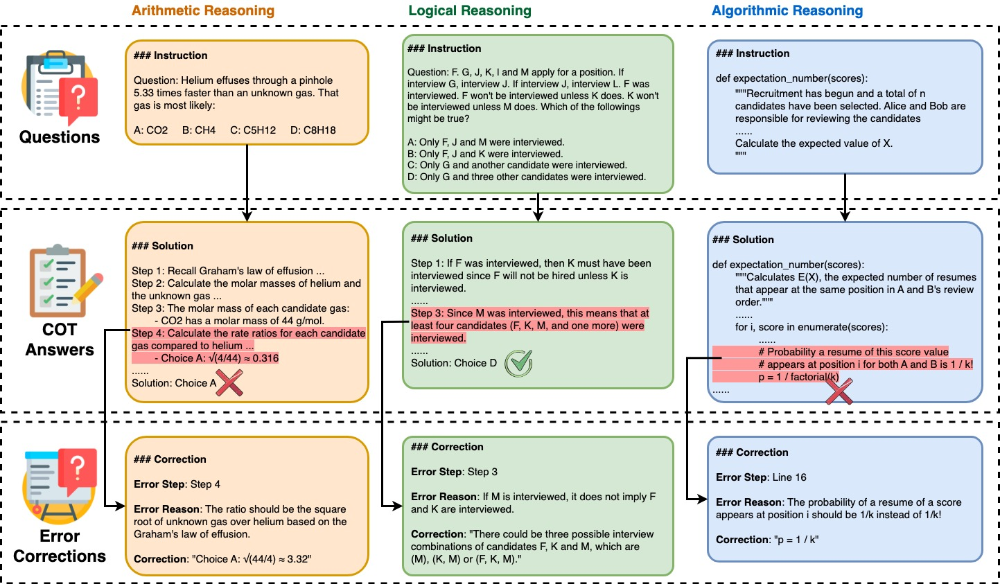

# Mr-Ben: A Comprehensive Meta-Reasoning Benchmark for Large Language Models

<p align="center">
📰 <a href="https://randolph-zeng.github.io/Mr-Ben.github.io/" target="_blank">Mr-Ben Official Website</a> • 🤗 <a href="https://huggingface.co/datasets/Randolphzeng/Mr-Ben" target="_blank">HF Dataset</a> • 📝 <a href="https://arxiv.org/abs/2406.13975" target="_blank"> Arxiv Paper </a><br>
</p>

Welcome to the official repository for the Mr-Ben dataset and related research. This repository serves as a hub for resources associated with our recent publication "Mr-Ben: A Comprehensive Meta-Reasoning Benchmark for Large Language Models". We have provided a demo evaluate script for you to try out benchmark in **mere two steps**. We encourage everyone to try out our benchmark in the SOTA models and return its results to us. We would be happy to include it in the `eval_results` and update the evaluation tables below for you.

## Relationship with Mr-GSM8K
Mr-Ben is the extention and continuation of [Mr-GSM8K](https://github.com/dvlab-research/MR-GSM8K), where we first brought up the concept of meta-reasoning and applied it to transform the original GSM8K dataset to a more challenging and comprehensive evaluation benchmark. If you are interested in thoroughly evaluate the reasoning abilities of your model, please do not forget to also check out Mr-GSM8k! We have provided a similar one-command evaluation script for your usage.

## About the Evaluation Benchmark

To comprehensively evaluate the reasoning capabilities of LLMs, Mr-Ben employs a meta-reasoning paradigm. This paradigm casts LLMs in the role of a teacher, where they assess the reasoning process by evaluating its correctness, analyzing errors, and providing corrections. As shown in the figure below, each data point within Mr-Ben consists of three key elements: a question, a CoT answer, and an error analysis.

For each question-solution pair annotated, the evaluated model are supposed to decide the correctness of the solution and report the first-error-step and error-reason if any. 
The solution-correctness and first-error-step is scored automatically based on the manual annotation result. Only when the evaluated model correctly identified the incorrect solution and first-error-step will its error-reason be further examined automatically by models (or manually if you want. For more discussion on the metrics please refer to section-4 of the paper.). Therefore in order to provide a unified and normalized score to reflect the overall competence of the evaluated model, we [follows our previous work MR-GSM8K](https://github.com/dvlab-research/MR-GSM8K) and applies metric named MR-Score, which consists of three sub-metrics. 



The first one is the Matthews Correlation Coefficient (e.g. MCC) for the binary classification of solution correctness. The MCC score ranges from -1 to +1 with -1 means total disagreement between prediction and observation, 0 indicates near random performance and +1 represents perfect prediction. Here we interpret negative values as no better than random guess and set 0 as cut-off threshold for normalization purpose. The second metric is the ratio between numbers of solutions with correct first error step predicted and the total number of incorrect solutions. The third metrics is likewise the ratio between number of solutions with correct first error step plus correct error reason predicted and the total number of incorrect solutions. 

The formula of MR-Score is defined as 
```
MR-Score = w_1 * max(0, MCC) + w_2 * Accuracy(step) + w_3 * Accuracy(reason)
```
where w_1, w_2, w_3 are chosen by considering the differentiation purpose (through grid-serach on the weights) and empirical task difficulties. 


## How to Evaluate on Mr-Ben
To reproduce the results from the paper or test it with your own models, please see `scripts/evaluate.py` files for more details. 
Here is a high level description of how you can evaluate your models (either open-sourced ones or proprietary models via APIs) on our dataset with two simple steps:

1. If you are testing a proprietary models via an API endpoint, please neglect this step and jump directly to step 2. If you are evaluating a local open-sourced model, please consider using vllm library to serve the API requests in OpenAI compatible way, as it is highly optimized for batch inferences and easy to deploy. Following is a sample command you can use to serve your open-sourced models. Note vllm supports most models recognized in the open-source community and apply chat template by default for you. If the tokenizer are too old to support chat template, you might need to apply it manually like `--chat-template /xxx/chat_template.jinja`  
```
python -u -m vllm.entrypoints.openai.api_server --host 0.0.0.0 --port 10245 --model /absolute/path/to/your/local/model --dtype half --gpu-memory-utilization 0.9  --max-model-len 8192 --tensor-parallel-size 4 --disable-log-requests
```   

2. Now that you have your local model served in an OpenAI API compatible way or a remote API server, we can asynchrounously request your model in a multi-thread way. Use the following command to invoke our evaluate script. We are currently supporting OpenAI style client, MistralAI client and Claude client:
```
python -m script.evaluate
  --dataset_path './data'
  --output_dir './eval_results' 
  --eval_base_url 'http://0.0.0.0:10245/v1'  
  --eval_api_key 'placeholder'  
  --eval_model_name '/absolute/path/to/your/local/model' 
  --score_base_url '' 
  --score_api_key 'sk-xxxx' 
  --score_model_name 'gpt-4-turbo-2024-04-09'  
  --shot_num 0  
  --max_workers 5   
  --demo_path './data/k-shot-demo.json'
```
Unless you start your vllm server with explicit api_key requirement, just leave the eval_api_key with any non-empty string. The eval-base-url/api-key/model-name and score-base-url/api-key/model-name are used to create your client for evaluation and scoring purpose. We recommend using gpt-4-turbo-2024-04-09 for the scoring as it is consistent with our paper. Shot number controls the number of demonstration for in context learning. The max-workers controls the thread numbers to request your server. 

Note 1: If you are evaluating some closed source commercial models, and they have customized clients, you might need to change the `utils.request_by_client` function in the script. It should be fairly straightforward to customized as shown in the function.

## Evaluation Results
We have provided a comprehensive list of evaluation results both [in our paper](https://arxiv.org/abs/2312.17080) and [in our official website](https://randolph-zeng.github.io/Mr-Ben.github.io/). Feel free to check them out! 

## How to Participate on Our LeaderBoard
If you would like to join our leaderboard and make the evaluation results of your model publicly available, pleas kindly use our provided evaluation script to conduct zero shot and one shot experiments, and then create a github issue with our provided template and submit your evaluation results to us.  

## Data Format
For each question we collected, we sampled three solutions from Mistral, Claude and GPT3.5. Following is the explanation of each field in the json. 
```
{
  'Question_UUID': 'the unique identifier of the question, each question has three candidate solutions sampled from different models',
  'Subject': 'the subject that this question belongs to',
  'Question': 'the subject question or coding question',
  'Options': 'the options of the multiple choice questions (this field is not present in coding question)'
  'Ground_Truth_Analysis': 'the ground truth analysis for the question',
  'Ground_Truth_Answer': 'the ground truth answer of the problem from the original datasets we sampled the question from',
  'Ground_Truth_Answer_Modified': 'the actual answer the annotators of our project believe should be. The annotation is based on this field. (this field is not present in coding question)',
  'Sampled_Model': 'the model that the following COT solution was sampled from'
  'Model_Solution_Steps': 'the candidate COT solution to be graded',
  'Model_Solution_Correctness': 'the correctness of the solution determined by our annotators, can only be correct or incorrect',
  'Model_Solution_First_Error_Step': 'the first error step of solution. N/A if not applicable',
  'Model_Solution_Error_Reason': 'the error reasons of the solution provided by our annotators independently, N/A if not applicable',
  'Model_Solution_Rectified_First_Error_Step': 'the rectified first error step of the solution, N/A if not applicable',
}
```

## Citation

If you use the Mr-Ben dataset or find our research beneficial to your work, we encourage you to cite our paper. Here is the BibTeX entry for citation:
```bibtex
@article{zeng2024mrben,
  author       = {Zhongshen Zeng and Yinhong Liu and Yingjia Wan and Jingyao Li and Pengguang Chen and Jianbo Dai and Yuxuan Yao and Rongwu Xu and Zehan Qi and Wanru Zhao and Linling Shen and Jianqiao Lu and Haochen Tan and Yukang Chen and Hao Zhang and Zhan Shi and Bailin Wang and Zhijiang Guo and Jiaya Jia},
  title        = {MR-BEN: A Comprehensive Meta-Reasoning Benchmark for Large Language Models},
  journal      = {CoRR},
  volume       = {abs/2406.13975},
  year         = {2024},
  url          = {https://arxiv.org/abs/2406.13975},
  eprinttype    = {arXiv},
  eprint       = {2406.13975}
}
